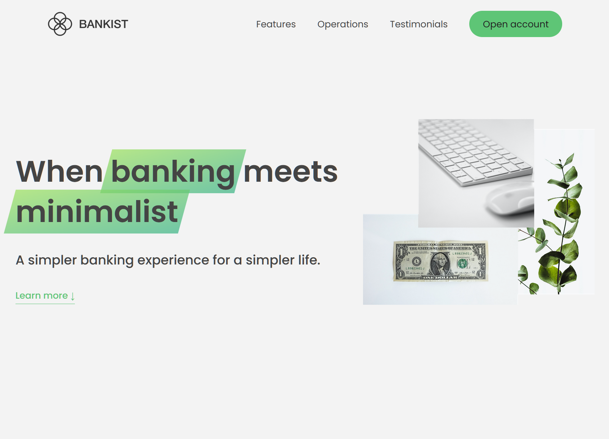
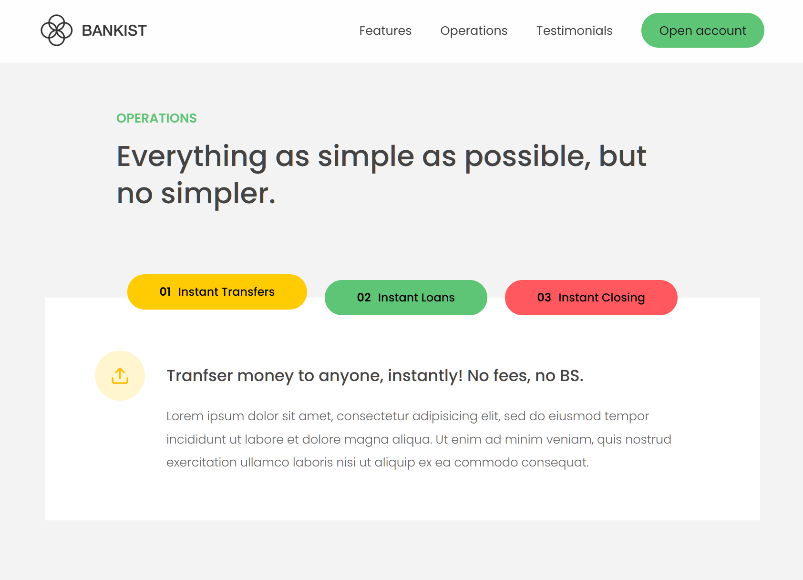
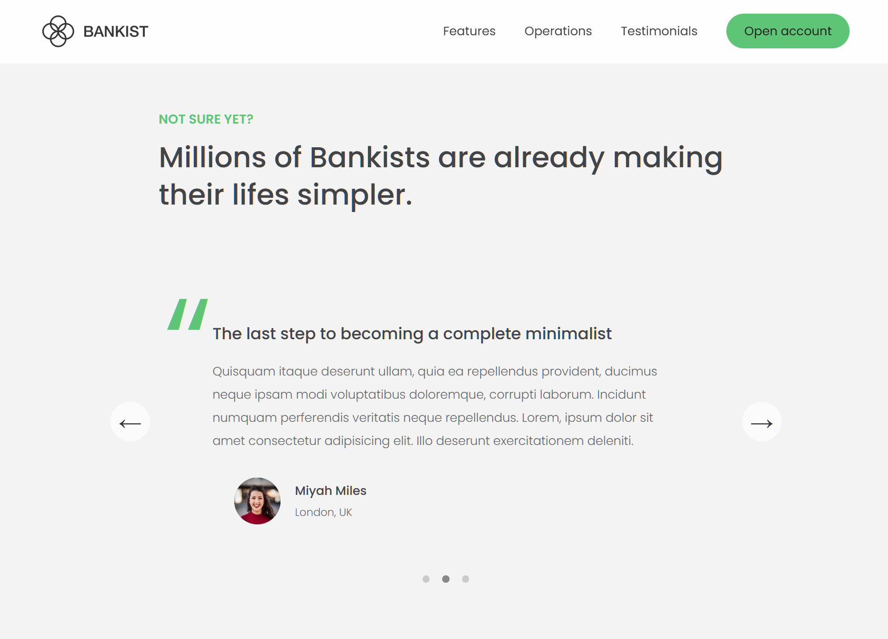

# Bankist Landing Page

[Experiment with the live version.](https://waters1993.github.io/javascript-landingpage/)

## Motivation & Acknowledgements

This project was created while completing "The Complete JavaScript Course 2021: From Zero to Expert!" by Jonas Schmedtmann.

## Work Vs. Template Code

HTML elements and CSS styling were provided as a template file for this landing page. 
I added JavaScript to add dynamic and interactive content to the page such as a sticky nav bar, a tabbed component, and a slider component. I utilized the intersection observer API to add smooth transitions to each section. Performance considerations included lazy loading images and efficient script loading. 

## JavaScript concepts and techniques used

- Event Propagation: Bubbling and Capturing
- Interstion Observer API
- Lazy loading images
- Smooth scroll
- Building tabed and slider components

## Site images

  
Landing Page

  
   
Tabbed component

  
 
Slider componet

  

## Built With

- HTML
- CSS
- JavaScript
- VS Code
- Git

## Author

- **James Waters**
  [james-waters](https://www.james-waters.com/)
